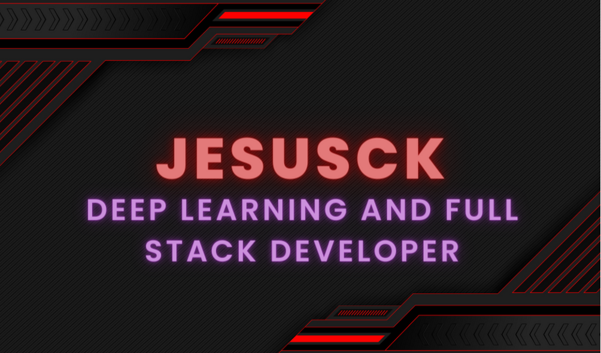

### Hi my name is Jesús Quiróz Rojas 👋

Electronic Engineering student in the ninth semester with experience as a teaching assistant in various subjects including calculus, pre-calculus, electromagnetic theory, modern physics, and signals and systems. Active participant in career-related tournaments such as the ZAGI AESS RACE 2022 in Bogotá, focusing on fixed-wing drones.

Proficient in Machine Learning projects, having developed classifiers, sign language translators, and human activity recognition systems in videos.

Engaged member of prominent student groups including IEEE and GEIFA (Study and Research Group in Physics). Passionate about science and outreach, with a self-directed approach to exploring modern theories.

Skilled in Python programming, demonstrated through application in diverse projects and contexts.
<!--
**JesusCK/JesusCK** is a ✨ _special_ ✨ repository because its `README.md` (this file) appears on your GitHub profile.

Here are some ideas to get you started:

- 🔭 I’m currently working on ...
- 🌱 I’m currently learning ...
- 👯 I’m looking to collaborate on ...
- 🤔 I’m looking for help with ...
- 💬 Ask me about ...
- 📫 How to reach me: ...
- 😄 Pronouns: ...
- ⚡ Fun fact: ...
-->

